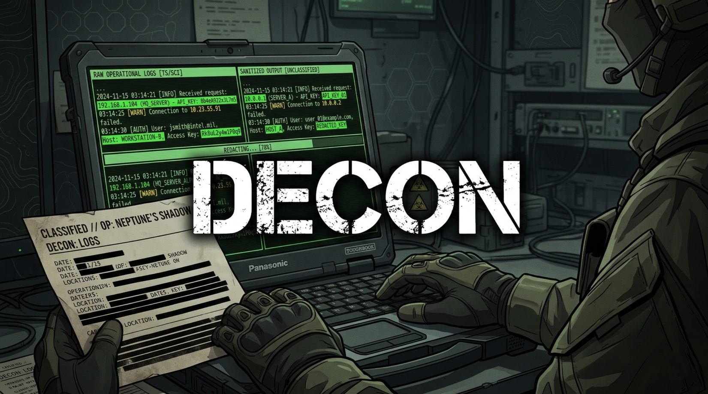

# DECON

<p align="center">
  
</p>

<p align="center">
  <strong>Sanitize operational data without destroying its analytical value.</strong>
</p>

<p align="center">
  
  
  
</p>

<p align="center">
  <a href="#quick-start">Quick start</a> ·
  <a href="#what-it-redacts">Rules</a> ·
  <a href="#everyday-workflows">Workflows</a> ·
  <a href="#configuration">Configuration</a> ·
  <a href="#optional-ollama-review">Ollama</a>
</p>

DECON replaces sensitive values in pentest, red-team, and CTF output with
consistent placeholders before the data is shared with an LLM, ticket, report,
or teammate.

```text
10.42.0.15 cannot reach 10.42.0.1. Retrying 10.42.0.15...
```

becomes:

```text
[IPV4_REDACTED_0001] cannot reach [IPV4_REDACTED_0002]. Retrying [IPV4_REDACTED_0001]...
```

The same value always receives the same placeholder, so relationships,
topology, and repetition remain visible.

> [!IMPORTANT]
> Redaction reduces exposure; it does not prove that text is safe. Review
> sensitive output before sharing it, especially when using custom rules or the
> optional LLM safety net.

## Quick start

Requires Python 3.11+ and has no runtime dependencies.

```bash
git clone https://github.com/BLTSEC/DECON.git
cd DECON

# Choose one
pipx install .
uv tool install .
```

```bash
# stdin -> stdout
cat pentest.log | decon

# files -> stdout
decon scan.txt nmap.txt

# file -> clipboard
decon -c scan.txt

# inspect before sharing
decon --diff scan.txt

# CI / pre-commit check: 0 = clean, 1 = redactions found
decon --check report.md
```

## Why DECON

| Capability | What it gives you |
|---|---|
| Consistent mapping | Repeated values keep the same identity after redaction |
| Typed placeholders | IPs, hosts, email addresses, secrets, and other values stay distinguishable |
| Operational awareness | Handles common Nmap, NetExec, Impacket, LDAP, Kerberos, SMB, and secretsdump formats |
| Reversible maps | Restore original values locally when a workflow requires it |
| Batch processing | Share one mapping across an entire engagement directory |
| Local LLM review | Ask Ollama to flag values the deterministic rules may have missed |
| Zero dependencies | Runs on the Python standard library |

## What it redacts

DECON applies ordered rules so high-specificity formats are handled before
generic patterns.

| Group | Examples |
|---|---|
| Network | IPv4, IPv6, CIDR, MAC addresses, URLs, internal hostnames, target domains, UNC paths |
| Credentials | Private keys, JWTs, AWS keys, passwords, tokens, CLI credentials, API secrets |
| Active Directory | Domain users, SPNs, SIDs, SAM/NTDS rows, NTLM/NTLMv2, Kerberos, DCC2, DPAPI |
| Identity and PII | Email addresses, phone numbers, SSNs, credit-card numbers with Luhn validation |
| Local context | Linux home directories, Windows user profiles, LDAP attributes, BloodHound descriptions |

Representative output:

```text
10.42.0.15                  -> [IPV4_REDACTED_0001]
2001:db8::15                -> [IPV6_REDACTED_0001]
aa:bb:cc:dd:ee:ff           -> [MAC_REDACTED_0001]
admin@example.org           -> [EMAIL_REDACTED_0001]
dc01.corp.local             -> [HOST_REDACTED_0001]
password=correct-horse      -> password=[SECRET_REDACTED_0001]
```

Use the CLI for the authoritative rule list:

```bash
decon --list-rules
decon --disable mac,phone scan.txt
decon --enable ssn report.txt
```

### Intentional pass-throughs

DECON avoids several common false positives:

- Loopback, unspecified, link-local, and documentation IPv4 ranges
- Public tool and reference URLs such as GitHub and MITRE ATT&CK
- Standard Nmap boilerplate URLs
- Windows built-in identities and registry paths
- Nmap port lists following `-p`

Use an allowlist when a value must remain unchanged:

```bash
decon --allow "scanme.nmap.org,10.0.0.1" scan.txt
```

## Everyday workflows

```bash
# Preview the values and placeholders without emitting redacted output
decon --dry-run scan.txt

# Show a unified diff
decon --diff scan.txt

# Show category statistics on stderr
decon --verbose scan.txt

# Capture the active tmux pane
decon --tmux -c

# Clipboard input -> file output
decon --clipboard-in --output clean.log

# Add case-insensitive values for this run
decon --redact "Project Nighthawk,jsmith" notes.md
```

If an explicitly requested input source such as `--tmux` or `--clipboard-in`
cannot be read, DECON exits non-zero instead of silently falling back to stdin.

### Batch processing

```bash
decon reports/**/*.txt --output-dir clean/
```

Files retain their relative paths and share one in-memory mapping:

```text
reports/web/scan.txt  -> clean/web/scan.redacted.txt
reports/ad/scan.txt   -> clean/ad/scan.redacted.txt
```

## Configuration

Create `~/.config/decon/decon.toml` with owner-only permissions:

```bash
decon --init-config
```

A compact configuration example:

```toml
default_profile = "standard"

[rules]
phone = false
credit_card = false

[custom]
values = ["Project Nighthawk"]
values_nocase = ["jsmith", "proddb"]
target_domains = ["corp.example"]
allowlist = ["scanme.nmap.org"]

[[custom.patterns]]
name = "ticket_ids"
pattern = 'CLIENT-[0-9]{4}'
replacement = "[CUSTOM_REDACTED_{n:04d}]"

[profiles.client-share]
hostname_internal = true
custom_values_extra = ["Internal Codename"]

[llm]
enabled = false
model = "qwen3.5:9b"
host = "http://localhost:11434"
```

Precedence is predictable:

```text
[rules] -> selected profile -> --enable / --disable
```

```bash
decon --profile client-share report.txt
DECON_PROFILE=client-share decon report.txt
```

Invalid tables, rule names, value types, regular expressions, and placeholder
templates fail with a concise configuration error. See
[`config.example.toml`](config.example.toml) for the complete example.

## Consistent and reversible mappings

Export a map when placeholders must remain stable across separate commands:

```bash
decon --export-map engagement.decon-map.json scan-1.txt > clean-1.txt
decon --import-map engagement.decon-map.json scan-2.txt > clean-2.txt

# Update the same map with newly discovered values
decon \
  --import-map engagement.decon-map.json \
  --export-map engagement.decon-map.json \
  scan-3.txt > clean-3.txt
```

Restore placeholders after local analysis:

```bash
echo "Investigate [IPV4_REDACTED_0001]:443" \
  | decon --unredact engagement.decon-map.json
```

> [!CAUTION]
> A map contains the original sensitive values. DECON writes maps atomically
> with mode `0600`, and this repository ignores `map.json` and
> `*.decon-map.json`. Never commit, upload, or share a reversible map.

Case-insensitive and canonicalized values—such as hostname case variants,
equivalent IPv6 spellings, and alternate MAC formats—share a placeholder. A
map retains the first-seen original spelling for reverse redaction.

## Optional Ollama review

Regex cannot reliably identify every bare username, project name, or unusual
credential. `--llm` sends the regex-redacted text to an Ollama-compatible
endpoint and asks it to report possible survivors.

```bash
brew install ollama
ollama serve
ollama pull qwen3.5:9b

decon --llm scan.txt
```

The LLM is a **reviewer, not an automatic redactor**. Findings are shown on
stderr in non-interactive runs. In an interactive terminal, you can choose
which findings to redact.

LLM review also works with:

- `--check` — LLM-only findings produce exit status 1
- `--dry-run` — findings appear in the preview
- `--diff` — reviews the proposed redacted text
- `--output-dir` — reviews every batch file and reports findings

Large inputs are reviewed in overlapping, line-aware chunks rather than being
truncated. If Ollama is unavailable, DECON warns and continues with the
deterministic rules.

> [!WARNING]
> The review text may still contain the exact sensitive values the regex rules
> missed. The default endpoint is local. Point `llm.host` only at a system you
> trust, and secure Ollama before exposing it to a container or network.

For a container, configure the host endpoint explicitly:

```toml
[llm]
enabled = true
host = "http://host.docker.internal:11434"
```

## NOCAP integration

DECON pairs with [NOCAP](https://github.com/BLTSEC/nocap) (`cap`) for a simple
capture -> sanitize -> share workflow.

```bash
# Sanitize the most recent capture to the clipboard
decon -c "$(cap last)"

# Include local LLM review
decon -c --llm "$(cap last)"

# Render a capture, sanitize it, and copy it
cap cat | decon -c

# Capture tmux history, then sanitize the result
cap grab
decon -c "$(cap last)"
```

Useful aliases:

```bash
alias dcap='decon -c "$(cap last)"'
alias dcap-llm='decon -c --llm "$(cap last)"'
```

## CLI at a glance

Run `decon --help` for the complete, current reference.

| Task | Command |
|---|---|
| Clipboard output | `-c`, `--clipboard` |
| File output | `-o FILE`, `--output FILE` |
| Batch output | `--output-dir DIR` |
| Tmux input | `--tmux` |
| Clipboard input | `--clipboard-in` |
| Preview | `--dry-run` |
| Unified diff | `--diff` |
| CI check | `--check` |
| Custom literals | `--redact VALUES` |
| Allowlist | `--allow VALUES` |
| Mapping | `--import-map FILE`, `--export-map FILE`, `--unredact FILE` |
| Rule control | `--enable RULES`, `--disable RULES`, `--list-rules` |
| Profile | `--profile NAME` |
| Local LLM review | `--llm` |

Environment variables:

| Variable | Purpose |
|---|---|
| `DECON_PROFILE=name` | Select a configuration profile |
| `DECON_LLM=1` | Enable Ollama review |

## Development

```bash
python -m venv .venv
source .venv/bin/activate
pip install -e '.[dev]'
pytest -q
```

## License

[MIT](LICENSE)
